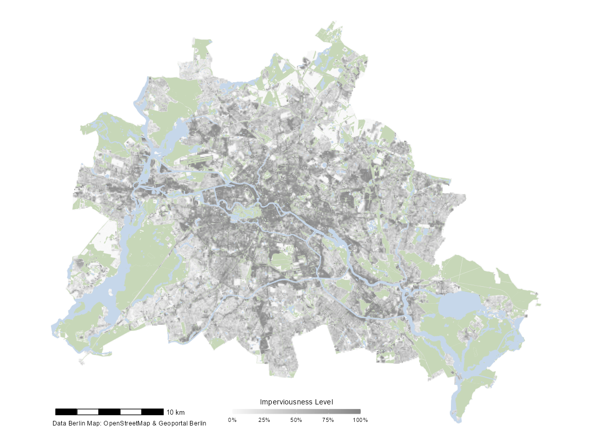
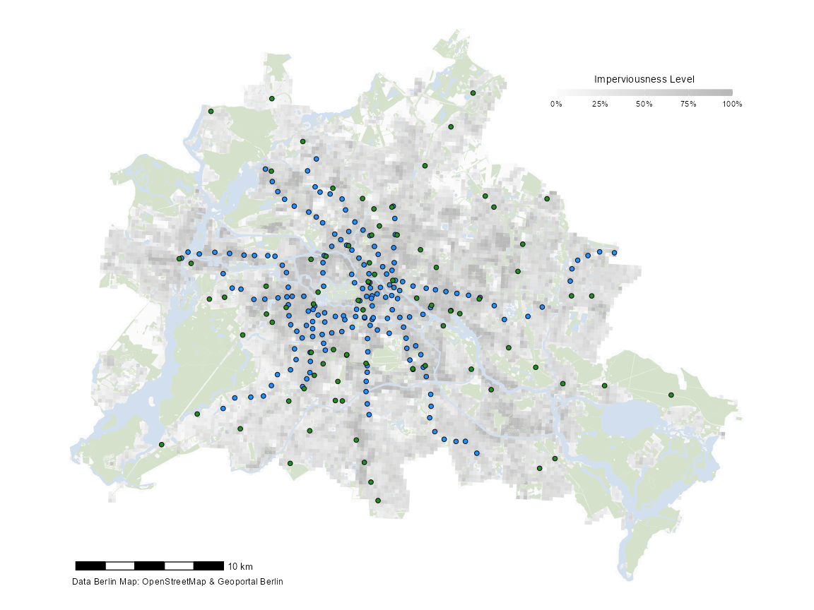

<!-- README.md is generated from README.Rmd. Please edit that file -->

# d6berlin

<!-- badges: start -->
<!-- badges: end -->

> The `d6berlin` package aims to provide template maps for Berlin with
> carefully chosen and aesthetically pleasing defaults. Template maps
> include green spaces, imperviousness levels, water bodeis, district
> borders, and roads plus the utility to add a globe with locator pin, a
> scalebar, and a caption to include the data sources. All objects are
> returned as `ggplot` objects.

<br>

------------------------------------------------------------------------

<br>

## Installation

You can install the `d6berlin` package from GitHub:

``` r
install.packages("devtools")
devtools::install_github("EcoDynIZW/d6berlin")
```

(Note: If you are asked if you want to update other packgaes either
press “No” (option 3) and continue or update the packages before running
the install command again.)

<br>

------------------------------------------------------------------------

<br>

## A Basic Template Map of Imperviousness

The basic template map shows levels of imperviousness and green areas in
Berlin. The imperviousness raster data was derived from [Geoportal
Berlin (FIS-Broker)]() with a resolution of 10m. The vector data on
green spaces was collected from data provided by the [OpenStreetMap
Contributors](https://www.openstreetmap.org/). The green spaces consist
of a mixture of landuse and natural categories (namely “forest”,
“grass”, “meadow”, “nature\_reserve”, “scrub”, “heath”, “beach”,
“cliff”).

The map is projected in **EPSG 4326 (WGS84)**.

``` r
library(d6berlin)

base_map_imp()
```



You can also customize the arguments, e.g. change the color intensity,
add a globe with a locator pin, change the resolution of the raster, and
move the legend to a custom position:

``` r
base_map_imp(color_intensity = 1, globe = TRUE, resolution = 500,
             legend_x = .17, legend_y = .12)
```


If you think the legend is absolute, there is also an option called
`"none"`. (The default is `"bottom"`. You can also use of the predefined
setting `"top"` as illustrated below or a custom position as shown in
the previous example.)

<br>

------------------------------------------------------------------------

<br>

## Adding Locations to the Map

Let’s assume you have recorded some animal locations or you want to plot
another information on to of this plot. For example, let’s visualize the
Berlin metro stations by adding `geom_sf(data = )` to the template map:

``` r
library(ggplot2)
library(sf)

map <- base_map_imp(color_intensity = .3, resolution = 250, legend = "top")

map + geom_sf(data = sf_metro)
```


**Note:** Since the template map contains many filled areas, we
recommend to add only point or line geometries (or maybe polygon
geometries without a filling) to the template maps

You can, of course, style the appearance of the points as usual:

``` r
map + geom_sf(data = sf_metro, shape = 8, color = "red", size = 2)
```


It is also possible to filter the data inside the `geom_sf` function —
no need to use `subset`:

``` r
library(dplyr) ## for filtering
library(stringr) ## for filtering based on name

map + 
  geom_sf(data = filter(sf_metro, str_detect(name, "^U")), 
          shape = 21, fill = "dodgerblue", size = 2) +
  geom_sf(data = filter(sf_metro, str_detect(name, "^S")), 
          shape = 21, fill = "forestgreen", size = 2)
```



You can also use the `mapping` functionality of ggplot2 to address
variables from your data set:

``` r
map + 
  geom_sf(data = sf_metro, aes(color = internet_access), size = 2) +
  scale_color_brewer(palette = "Dark2", 
                     name = "Internet Access?",
                     na.value = "grey60") +
  guides(color = guide_legend(direction = "horizontal",
                              title.position = "top", 
                              title.hjust = .5))
```


(It looks better if you style the legend in the same horizontal layout.)

<br>

------------------------------------------------------------------------

<br>

## Custom Styling

Since the output is a `ggplot` object, you can manipulate the result as
you like (but don’t apply a new theme, this will mess up the legend
design):

``` r
library(systemfonts) ## for title font

base_map_imp(color_intensity = 1, resolution = 250, globe = TRUE,
             legend_x = .17, legend_y = .12) + 
  geom_sf(data = sf_metro, shape = 21, fill = "white", 
          stroke = .4, size = 4) +
  ggtitle("Metro Stations in Berlin") + 
  theme(plot.title = element_text(size = 30, hjust = .5, family = "Bangers"),
        panel.grid.major = element_line(color = "white", size = .3),
        axis.text = element_text(color = "black", size = 8),
        plot.background = element_rect(fill = "#fff0de", color = NA),
        plot.margin = margin(rep(20, 4)))
```


<br>

------------------------------------------------------------------------

<br>

## Save Map

Unfortunately, the size of the text elements is fixed. The best aspect
ratio to export the map is 12x9 and you can save it with `ggsave()` for
example:

``` r
ggsave("metro_map.pdf", width = 12, height = 9, device = cairo_pdf)
```

<br>

------------------------------------------------------------------------

<br>

#### Attribution-NonCommercial-ShareAlike 4.0 International (CC BY-NC-SA 4.0)

<div style="width:300px; height:200px">


</div>

<details>
<summary>
Session Info
</summary>

``` r
Sys.time()
#> [1] "2021-04-15 20:10:49 CEST"
git2r::repository()
#> Local:    main C:/Users/DataVizard/PopDynIZW Dropbox/GeoData/d6berlin
#> Remote:   main @ origin (https://github.com/EcoDynIZW/d6berlin.git)
#> Head:     [f5d1862] 2021-04-15: :memo: update readme
sessionInfo()
#> R version 4.0.4 (2021-02-15)
#> Platform: x86_64-w64-mingw32/x64 (64-bit)
#> Running under: Windows 10 x64 (build 19041)
#> 
#> Matrix products: default
#> 
#> locale:
#> [1] LC_COLLATE=German_Germany.1252  LC_CTYPE=German_Germany.1252   
#> [3] LC_MONETARY=German_Germany.1252 LC_NUMERIC=C                   
#> [5] LC_TIME=German_Germany.1252    
#> system code page: 65001
#> 
#> attached base packages:
#> [1] stats     graphics  grDevices utils     datasets  methods   base     
#> 
#> other attached packages:
#> [1] systemfonts_1.0.1   stringr_1.4.0       dplyr_1.0.5        
#> [4] sf_0.9-7            ggplot2_3.3.3       d6berlin_0.0.0.9000
#> 
#> loaded via a namespace (and not attached):
#>  [1] Rcpp_1.0.6          rnaturalearth_0.1.0 lattice_0.20-41    
#>  [4] png_0.1-7           class_7.3-18        assertthat_0.2.1   
#>  [7] digest_0.6.27       utf8_1.2.1          R6_2.5.0           
#> [10] stats4_4.0.4        evaluate_0.14       e1071_1.7-4        
#> [13] highr_0.8           pillar_1.5.1        rlang_0.4.10       
#> [16] raster_3.4-5        rmarkdown_2.6       textshaping_0.3.3  
#> [19] labeling_0.4.2      webshot_0.5.2       rgdal_1.5-23       
#> [22] htmlwidgets_1.5.3   munsell_0.5.0       compiler_4.0.4     
#> [25] xfun_0.22           pkgconfig_2.0.3     base64enc_0.1-3    
#> [28] rgeos_0.5-5         htmltools_0.5.1.1   tidyselect_1.1.0   
#> [31] tibble_3.1.0        codetools_0.2-18    mapview_2.9.0      
#> [34] fansi_0.4.2         withr_2.4.1         crayon_1.4.1       
#> [37] grid_4.0.4          satellite_1.0.2     lwgeom_0.2-5       
#> [40] gtable_0.3.0        lifecycle_1.0.0     DBI_1.1.1          
#> [43] git2r_0.28.0        magrittr_2.0.1      units_0.6-7        
#> [46] scales_1.1.1        KernSmooth_2.23-18  stringi_1.5.3      
#> [49] debugme_1.1.0       farver_2.1.0        leaflet_2.0.4.1    
#> [52] sp_1.4-5            ellipsis_0.3.1      ragg_1.1.2         
#> [55] generics_0.1.0      vctrs_0.3.6         RColorBrewer_1.1-2 
#> [58] tools_4.0.4         ggspatial_1.1.5     leafem_0.1.3       
#> [61] glue_1.4.2          purrr_0.3.4         crosstalk_1.1.1    
#> [64] abind_1.4-5         parallel_4.0.4      yaml_2.2.1         
#> [67] colorspace_2.0-0    stars_0.5-1         classInt_0.4-3     
#> [70] knitr_1.31
```

</details>
