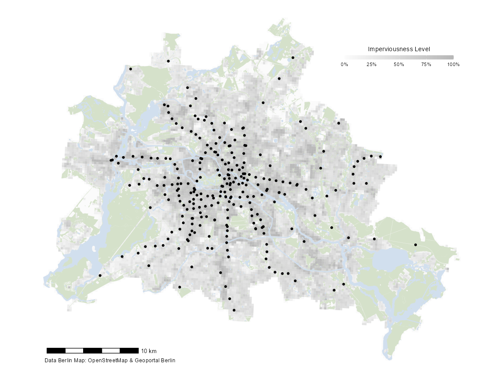
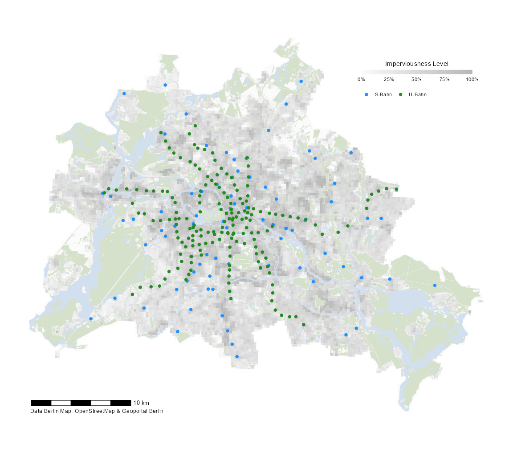

<!-- README.md is generated from README.Rmd. Please edit that file -->

# d6berlin

<!-- badges: start -->
<!-- badges: end -->

The `d6berlin` package aims to provide template maps for Berlin with
carefully chosen and aesthetically pleasing defaults. Template maps
include green spaces, imperviousness levels, water bodeis, district
borders, and roads plus the utility to add a globe with locator pin, a
scalebar, and a caption to include the data sources. All objects are
returned as `ggplot` objects.

## Installation

You can install the `d6berlin` package from GitHub:

``` r
devtools::install_github("EcoDynIZW/d6maps")
```

## A Basic Template Map of Imperviousness

``` r
library(d6berlin)

base_map_imp()
```


You can also customize the arguments, e.g. change the color intensity,
add a globe with a locator pin and change the resolution of the raster:

``` r
base_map_imp(color_intensity = 1, globe = TRUE, resolution = 500)
```


## Adding Locations to the Map

Let’s assume you have recorded some animal locations or you want to plot
another information on to of this plot. For example, let’s visualize the
Berlin metro stations by adding `geom_sf(data = )` to the template map:

``` r
library(ggplot2)
library(sf)

map <- base_map_imp(color_intensity = .3, resolution = 250)

map + geom_sf(data = sf_metro)
```



**Note:** Since the template map contains many filled areas, we
recommend to add only point or line geometries (or maybe polygon
geometries without a filling) to the template maps

You can, of course, style the appearance of the points as usual:

``` r
map + geom_sf(data = sf_metro, shape = 8, color = "red", size = 2)
```


It is also possible to filter the data inside the `geom_sf` function —
no need to use `subset`:

``` r
library(dplyr) ## for filtering
library(stringr) ## for filtering based on name

map + 
  geom_sf(data = filter(sf_metro, str_detect(name, "^U")), 
          shape = 21, fill = "blue", size = 2) +
  geom_sf(data = filter(sf_metro, str_detect(name, "^S")), 
          shape = 21, fill = "forestgreen", size = 2)
```


YOu can also use the `mapping` of ggplot2:

``` r
map + 
  geom_sf(data = sf_metro, aes(color = internet_access), size = 2) +
  scale_color_brewer(palette = "Dark2", 
                     name = "Internet Access?",
                     na.value = "grey60") +
  guides(color = guide_legend(direction = "horizontal",
                              title.position = "top", 
                              title.hjust = .5))
```



(It looks better if you style the legend in the same horizontal layout.)

## Custom Styling

Since the output is a `ggplot` object, you can manipulate the result as
you like (but don’t apply a new theme, this will mess up the legend
design):

``` r
library(systemfonts) ## for title font

map + 
  geom_sf(data = sf_metro, shape = 21, fill = "white", 
          stroke = .4, size = 2.5) +
  ggtitle("Metro Stations in Berlin") + 
  theme(plot.title = element_text(size = 30, hjust = .5, family = "Bangers"),
        panel.grid.major = element_line(color = "grey80", size = .3),
        axis.text = element_text(color = "grey60", size = 8))
```


