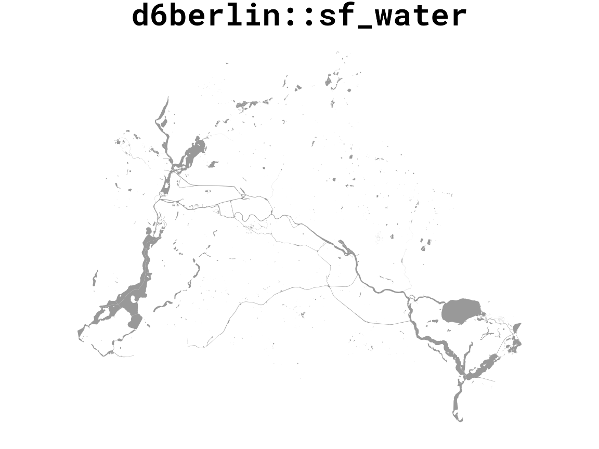

<!-- README.md is generated from README.Rmd. Please edit that file -->

# d6berlin </a>

<!-- badges: start -->
<!-- badges: end -->

> The `d6berlin` package aims to provide spatial data and template maps
> for Berlin. The data sets include green spaces, water bodies, district
> borders, raleways and more. A template map of imperviousness across
> Berlin with carefully chosen and aesthetically pleasing default is
> included to serve as a base map to visualize spatial data.

<br>

# 

<br>

## Installation

You can install the `d6berlin` package from GitHub:

``` r
install.packages("devtools")
devtools::install_github("EcoDynIZW/d6berlin")
```

(Note: If you are asked if you want to update other packages either
press “No” (option 3) and continue or update the packages before running
the install command again.)

Afterwards, load the functionality and data of the package in each
session:

``` r
library(d6berlin)
```

<br>

# 

<br>

## Berlin Data Sets

The package contains several data sets for Berlin. All of them start
with `sf_`, e.g. `d6berlin::sf_roads`. Here is a full overview of the
data sets that are stored as *simple feature objects* and directly
accessible:

``` text
sf_berlin      -- Berlin border
sf_districts   -- district borders
sf_green       -- green spaces
sf_metro       -- U- and S-train stations
sf_railways    -- railroad lines
sf_roads       -- motorways and streets
sf_water       -- water ways and bodies
```



More information about each data set is available in the help:

``` r
?sf_green
```

> An sf object containing the shape of all green spaces (defined as
> natural areas and landuse categories “forest”, “grass”, “meadow”,
> “nature_reserve”, “scrub”, “heath”, “beach”, and “cliff”) in Berlin.

Furthermore, you can work with the spatial data as you usually do:

``` r
unique(sf_green$fclass)
#> [1] "scrub"          "grass"          "forest"         "meadow"        
#> [5] "nature_reserve" "beach"          "heath"          "cliff"

sf_forests <- subset(sf_green, fclass == "forest")
head(sf_forests)
#> Simple feature collection with 6 features and 7 fields
#> Geometry type: POLYGON
#> Dimension:     XY
#> Bounding box:  xmin: 13.22869 ymin: 52.54882 xmax: 13.37107 ymax: 52.61291
#> Geodetic CRS:  WGS 84
#> # A tibble: 6 x 8
#>   osm_id    code fclass name              district_name district_id district_key
#>   <fct>    <int> <chr>  <chr>             <chr>         <chr>              <dbl>
#> 1 5643109   7201 forest  <NA>             Reinickendorf 012             11000012
#> 2 3085634   7201 forest  <NA>             Reinickendorf 012             11000012
#> 3 23353374  7201 forest "Lindwerder"      Reinickendorf 012             11000012
#> 4 24482177  7201 forest  <NA>             Reinickendorf 012             11000012
#> 5 3085413   7201 forest "NABU-Schutzgebi~ Reinickendorf 012             11000012
#> 6 27835164  7201 forest  <NA>             Reinickendorf 012             11000012
#> # ... with 1 more variable: geometry <POLYGON [°]>
```

# 

<br>

## A Basic Template Map of Imperviousness

The basic template map shows levels of imperviousness and green areas in
Berlin. The imperviousness raster data was derived from [Geoportal
Berlin
(FIS-Broker)](https://www.stadtentwicklung.berlin.de/geoinformation/fis-broker/)
with a resolution of 10m. The vector data on green spaces was collected
from data provided by the [OpenStreetMap
Contributors](https://www.openstreetmap.org/). The green spaces consist
of a mixture of land use and natural categories (namely “forest”,
“grass”, “meadow”, “nature_reserve”, “scrub”, “heath”, “beach”,
“cliff”).

The map is projected in **EPSG 4326 (WGS84)**.

``` r
base_map_imp()
```


You can also customize the arguments, e.g. change the color intensity,
add a globe with a locator pin, change the resolution of the raster, and
move the legend to a custom position:

``` r
base_map_imp(color_intensity = 1, globe = TRUE, resolution = 500,
             legend_x = .17, legend_y = .12)
```


If you think the legend is absolute, there is also an option called
`"none"`. (The default is `"bottom"`. You can also use of the predefined
setting `"top"` as illustrated below or a custom position as shown in
the previous example.)

<br>

## Adding Locations to the Map

Let’s assume you have recorded some animal locations or you want to plot
another information on top of our base map. For example, let’s visualize
the Berlin metro stations by adding `geom_sf(data = x)` to the `map`
object:

``` r
library(ggplot2)
library(sf)

map <- base_map_imp(color_intensity = .3, resolution = 250, legend = "top")

map + geom_sf(data = sf_metro) ## sf_metro is contained in the d6berlin package
```


**Note:** Since the template map contains many filled areas, we
recommend to add geometries with variables mapped to `color|xolour|col`
to the template maps.

You can, of course, style the appearance of the points as usual:

``` r
map + geom_sf(data = sf_metro, shape = 8, color = "red", size = 2)
```


It is also possible to filter the data inside the `geom_sf` function —
no need to use `subset`:

``` r
library(dplyr) ## for filtering
library(stringr) ## for filtering based on name

map + 
  geom_sf(data = filter(sf_metro, str_detect(name, "^U")), 
          shape = 21, fill = "dodgerblue", size = 2) +
  geom_sf(data = filter(sf_metro, str_detect(name, "^S")), 
          shape = 21, fill = "forestgreen", size = 2)
```


You can also use the `mapping` functionality of ggplot2 to address
variables from your data set:

``` r
map + 
  geom_sf(data = sf_metro, aes(color = type), size = 2) +
  scale_color_discrete(type = c("dodgerblue", "forestgreen"), 
                       name = NULL) +
  guides(color = guide_legend(direction = "horizontal",
                              title.position = "top", 
                              title.hjust = .5))
```


(It looks better if you style the legend in the same horizontal layout.)

<br>

# 

<br>

## Custom Styling

Since the output is a `ggplot` object, you can manipulate the result as
you like (but don’t apply a new theme, this will mess up the legend
design):

``` r
library(systemfonts) ## for title font

base_map_imp(color_intensity = 1, resolution = 250, globe = TRUE,
             legend_x = .17, legend_y = .12) + 
  geom_sf(data = sf_metro, shape = 21, fill = "white", 
          stroke = .4, size = 4) +
  ggtitle("Metro Stations in Berlin") + 
  theme(plot.title = element_text(size = 30, hjust = .5, family = "Bangers"),
        panel.grid.major = element_line(color = "white", size = .3),
        axis.text = element_text(color = "black", size = 8),
        plot.background = element_rect(fill = "#fff0de", color = NA),
        plot.margin = margin(rep(20, 4)))
```


<br>

# 

<br>

## Save Map

Unfortunately, the size of the text elements is fixed. The best aspect
ratio to export the map is 12x9 and you can save it with `ggsave()` for
example:

``` r
ggsave("metro_map.pdf", width = 12, height = 9, device = cairo_pdf)
```

<br>

# 

<details>
<summary>
Session Info
</summary>

``` r
Sys.time()
#> [1] "2022-02-28 16:06:22 CET"
git2r::repository()
#> Local:    main C:/Users/DataVizard/PopDynIZW Dropbox/GeoData/d6berlin
#> Remote:   main @ origin (https://github.com/EcoDynIZW/d6berlin.git)
#> Head:     [fe860e1] 2022-02-28: update readme and data description
sessionInfo()
#> R version 4.1.2 (2021-11-01)
#> Platform: x86_64-w64-mingw32/x64 (64-bit)
#> Running under: Windows 10 x64 (build 19043)
#> 
#> Matrix products: default
#> 
#> locale:
#> [1] LC_COLLATE=German_Germany.1252  LC_CTYPE=German_Germany.1252   
#> [3] LC_MONETARY=German_Germany.1252 LC_NUMERIC=C                   
#> [5] LC_TIME=German_Germany.1252    
#> system code page: 65001
#> 
#> attached base packages:
#> [1] stats     graphics  grDevices utils     datasets  methods   base     
#> 
#> other attached packages:
#> [1] systemfonts_1.0.3   stringr_1.4.0       dplyr_1.0.7        
#> [4] sf_1.0-5            ggplot2_3.3.5       d6berlin_0.0.0.9000
#> 
#> loaded via a namespace (and not attached):
#>  [1] rnaturalearth_0.1.0 assertthat_0.2.1    sp_1.4-6           
#>  [4] highr_0.9           stats4_4.1.2        yaml_2.2.1         
#>  [7] pillar_1.6.4        lattice_0.20-45     glue_1.4.2         
#> [10] digest_0.6.29       colorspace_2.0-2    htmltools_0.5.2    
#> [13] pkgconfig_2.0.3     ggspatial_1.1.5     raster_3.5-11      
#> [16] stars_0.5-5         s2_1.0.7            purrr_0.3.4        
#> [19] scales_1.1.1        webshot_0.5.2       terra_1.4-22       
#> [22] satellite_1.0.4     git2r_0.29.0        tibble_3.1.6       
#> [25] proxy_0.4-26        generics_0.1.1      farver_2.1.0       
#> [28] ellipsis_0.3.2      withr_2.4.3         cli_3.1.0          
#> [31] mapview_2.10.0      magrittr_2.0.1      crayon_1.4.2       
#> [34] evaluate_0.14       fansi_0.5.0         lwgeom_0.2-8       
#> [37] class_7.3-19        textshaping_0.3.6   tools_4.1.2        
#> [40] lifecycle_1.0.1     munsell_0.5.0       compiler_4.1.2     
#> [43] e1071_1.7-9         rlang_0.4.12        classInt_0.4-3     
#> [46] units_0.7-2         grid_4.1.2          rstudioapi_0.13    
#> [49] htmlwidgets_1.5.4   crosstalk_1.2.0     leafem_0.1.6       
#> [52] base64enc_0.1-3     labeling_0.4.2      rmarkdown_2.11     
#> [55] wk_0.6.0            gtable_0.3.0        codetools_0.2-18   
#> [58] abind_1.4-5         DBI_1.1.2           R6_2.5.1           
#> [61] knitr_1.36          rgdal_1.5-28        fastmap_1.1.0      
#> [64] utf8_1.2.2          ragg_1.1.3          KernSmooth_2.23-20 
#> [67] stringi_1.7.5       parallel_4.1.2      Rcpp_1.0.7         
#> [70] vctrs_0.3.8         png_0.1-7           leaflet_2.0.4.1    
#> [73] tidyselect_1.1.1    xfun_0.27
```

</details>

------------------------------------------------------------------------

<br>

#### Attribution-NonCommercial-ShareAlike 4.0 International (CC BY-NC-SA 4.0)

<div style="width:300px; height:200px">


</div>
